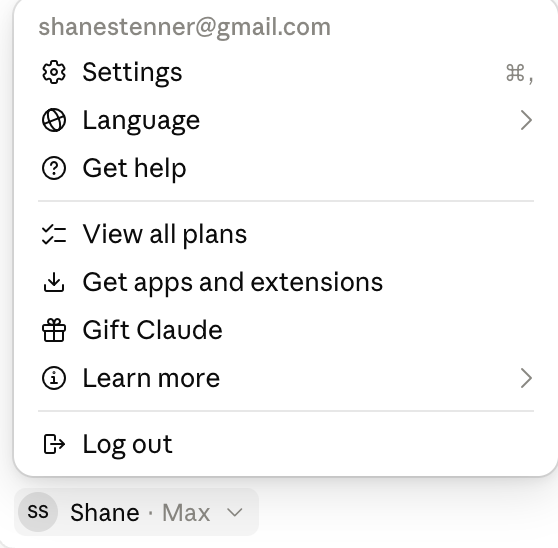
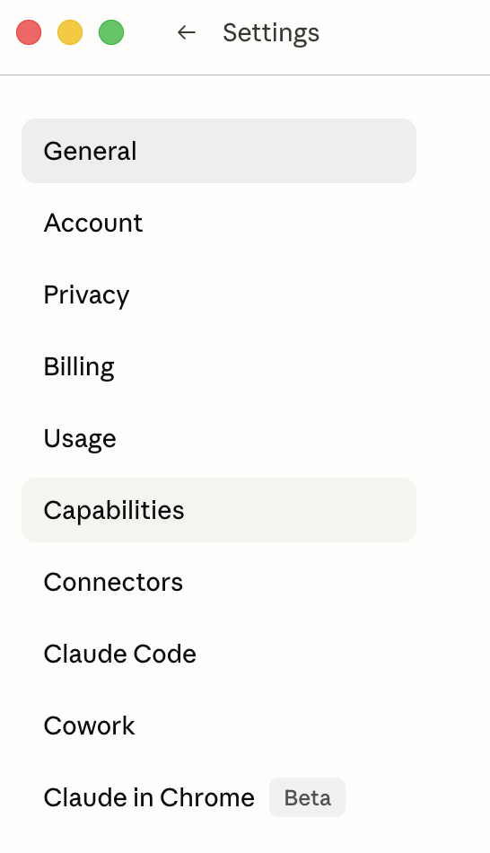
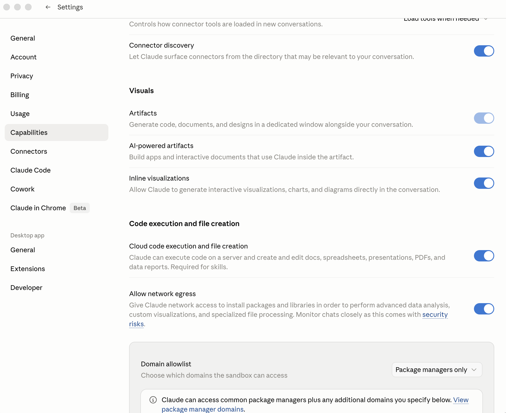
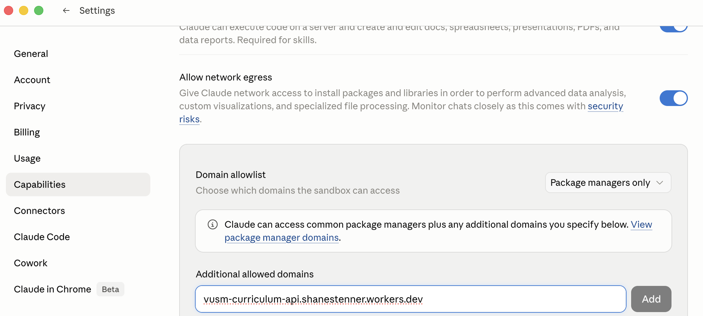
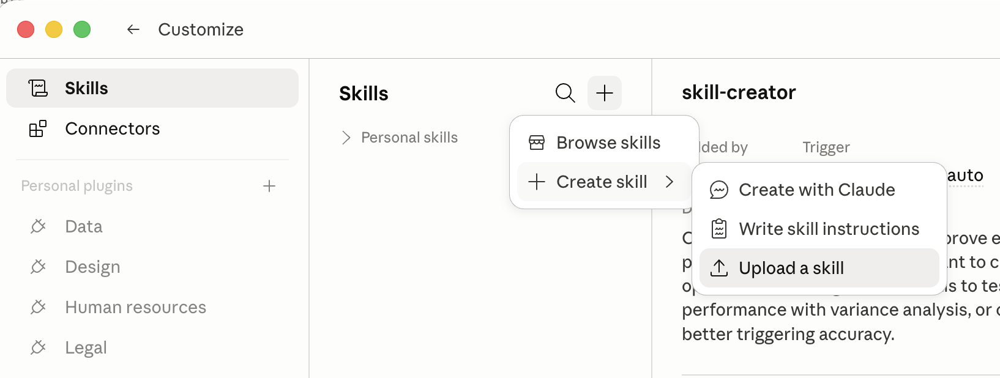
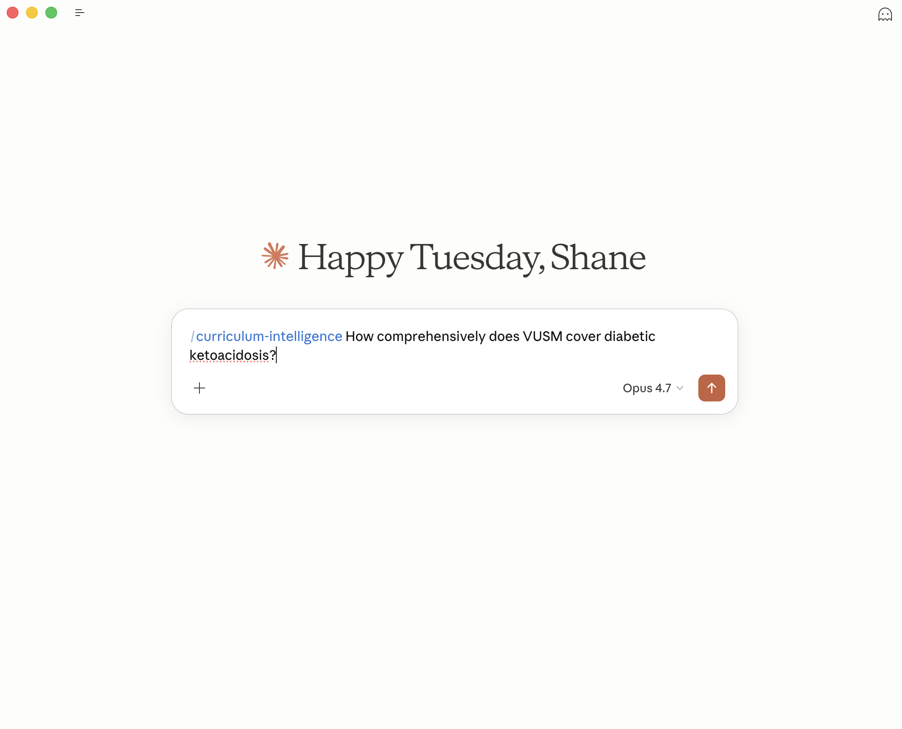
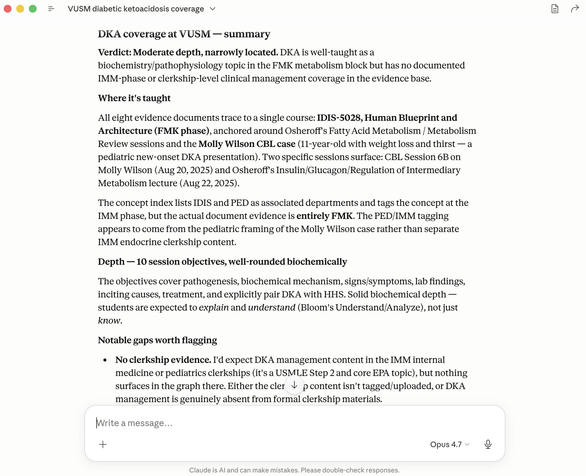

# Installing on claude.ai (web browser)

These are the click-by-click steps for installing the Curriculum Intelligence skill in your web browser. The main [README](README.md) has the short version; this is the detailed walkthrough.

**Authoritative source:** Anthropic's [Use Skills in Claude](https://support.claude.com/en/articles/12512180-use-skills-in-claude#h_a4222fa77b) article. If the UI labels below ever drift from what you actually see, follow Anthropic's article — they update it as Claude evolves.

Tested on Chrome, Safari, Firefox, and Edge.

---

## Prerequisites: Capabilities settings (one-time)

You need three things configured before the skill can talk to the curriculum API. Once set, you don't need to revisit them.

### Step 1: Open Settings → Capabilities

1. Open **[claude.ai](https://claude.ai)** and sign in.
2. Click your profile (bottom-left) and choose **Settings**.

   

3. In the Settings sidebar, click **Capabilities**.

   

### Step 2: Enable code execution and network egress

In the Capabilities panel, make sure both of these are toggled on:

- **"Code execution and file creation"** — lets the skill run code in a sandbox.
- **"Allow network egress"** — lets that sandboxed code reach the internet.



### Step 3: Add the curriculum API to the Domain allowlist

Scroll down to the **Domain allowlist** section. By default it's set to "Package managers only," which means the sandbox can reach npm / PyPI / etc. but NOT our curriculum API. You need to add our hostname explicitly.

In the **"Additional allowed domains"** field, paste:

```
vusm-curriculum-api.shanestenner.workers.dev
```

Click **Add**.



Without this step, the skill will install successfully and appear in your Skills list — but every query that tries to reach the curriculum data will fail. (If you'd prefer, switching the dropdown to **"All domains"** also works; it's just a broader setting.)

---

## Step 1: Open the Skills section

In the top navigation (or sidebar, depending on your account view), click **Customize**. Then click **Skills**.


You should see a list of any skills already on your account (probably empty for a new install).

## Step 2: Add a new skill

Click the **"+"** button at the top-right of the Skills list. A small menu appears.



Click **"+ Create skill"** in that menu.

## Step 3: Upload the bundle

In the dialog that opens, click **"Upload a skill"** (rather than building one from scratch). A file picker opens. Navigate to where Shane's email saved your `curriculum-intelligence-<your-name>.zip` file (usually your Downloads folder) and select it.


Claude reads the bundle and shows a preview:

- **Name:** `curriculum-intelligence`
- **Description:** starts with *"Curriculum Intelligence for VUSM faculty — query the Vanderbilt medical school curriculum knowledge graph…"*

Click confirm/save.

## Step 4: Verify it appears in the list

The skill should now show up in your Skills list as "Curriculum Intelligence" with a toggle (default: on).


## Step 5: Try a query

Open a new conversation (top-left "+ New chat") and ask:

> How comprehensively does VUSM cover diabetic ketoacidosis?

You can also invoke the skill explicitly via the slash menu — type `/curriculum-intelligence` and Claude will scope to the skill, then continue with your question:



A successful response names specific VUSM courses, sessions, MEPOs, and Bloom's-level coverage — not just a generic medical-textbook answer:



If you get a generic medical answer with no VUSM specifics, the skill probably didn't activate — go back to **Customize → Skills** and confirm the toggle is on.

---

## Troubleshooting

**"Code execution must be enabled" or similar error.**
The prerequisite step above (Capabilities → "Code execution and file creation") wasn't completed for your account. Go back to that section.

**The upload says "Skill not valid" or "Invalid skill structure."**
- Make sure you're uploading the **`.zip` file**, not the unzipped folder.
- The zip is named `curriculum-intelligence-<your-name>.zip`.
- File size should be under ~50 KB (the bundle is tiny).

**The skill is listed but Claude doesn't seem to be using it.**
- Try asking a more clearly VUSM-curriculum-flavored question: include the word "VUSM" or "curriculum" explicitly.
- Confirm the skill's toggle is on in Customize → Skills.

**Claude says it can't reach the API / "request failed."**
Most common cause: **the API hostname isn't in your Domain allowlist.** Go to Settings → **Capabilities** → scroll down to **Additional allowed domains** and confirm `vusm-curriculum-api.shanestenner.workers.dev` is listed. Also confirm **"Allow network egress"** is on.

If both are set correctly, it's probably a transient network issue — try again in 30 seconds. If it persists for more than a minute, email Shane.

**I want to remove the skill.**
Customize → Skills → Curriculum Intelligence → Remove. The bundle is deleted from your account; if you want to come back, you can re-upload the same zip later (the key inside stays valid until the pilot ends or you ask Shane to revoke it).

If the UI doesn't match this guide exactly, Anthropic's [official guide](https://support.claude.com/en/articles/12512180-use-skills-in-claude#h_a4222fa77b) is the most current source.
