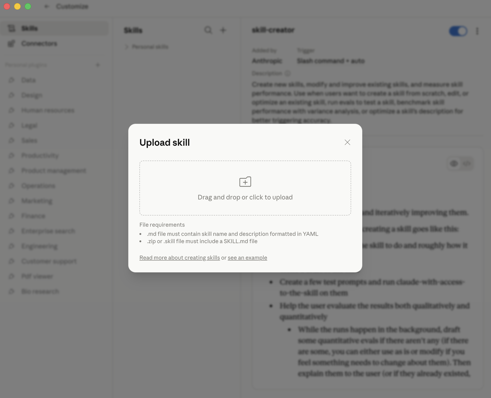

# Installing on claude.ai (web browser)

These are the click-by-click steps for installing the Curriculum Intelligence skill in your web browser, with screenshots. The main [README](README.md) has the short version; this is the detailed walkthrough.

Tested on Chrome, Safari, Firefox, and Edge.

---

## 1. Sign in

Go to **[claude.ai](https://claude.ai)** and sign in with the account you'd like to use. Personal or Vanderbilt SSO both work fine.

## 2. Open Settings

Click your **profile icon** in the top-right corner, then click **Settings**.

## 3. Navigate to Skills

In the Settings sidebar, click **Skills**.

## 4. Upload the bundle

Click **Create new skill** (the wording may also say "Upload skill"). A dialog opens. Drag the `curriculum-intelligence-<your-name>.zip` file from your Downloads folder (or wherever Shane's email saved it) into the upload area.

Claude will read the bundle and show you a preview: the skill's name should be "**curriculum-intelligence**" and the description should mention "Curriculum Intelligence for VUSM faculty." Confirm.

## 5. Verify

The skill should now appear in your Skills list as "Curriculum Intelligence" with a toggle switch (default: on).

## 6. Try a query

Open a new conversation (top-left "+ New chat") and ask:

> How comprehensively does VUSM cover diabetic ketoacidosis?

Claude should pull curriculum data and give you a substantive answer with course names, session-level evidence, and Bloom's-level coverage. If you get a generic answer that doesn't mention VUSM courses, the skill probably didn't activate — check Settings → Skills and confirm the toggle is on.

---

## Troubleshooting

**The upload says "Skill not valid" or similar.**
Make sure you're uploading the **`.zip` file** (not the unzipped folder). The zip is named `curriculum-intelligence-<your-name>.zip`.

**The skill is listed but Claude doesn't seem to be using it.**
Try asking a more clearly VUSM-curriculum-flavored question: include the word "VUSM" or "curriculum" explicitly. The skill activates on those keyword triggers.

**Claude says it can't reach the API / "request failed."**
This is usually a transient network issue. Try again in 30 seconds. If it persists for more than a minute, email Shane.

**I want to remove the skill.**
Settings → Skills → Curriculum Intelligence → Remove. The bundle is deleted from your account; if you want to come back, you can re-upload the same zip later (the key inside stays valid until the pilot ends or you ask Shane to revoke it).
