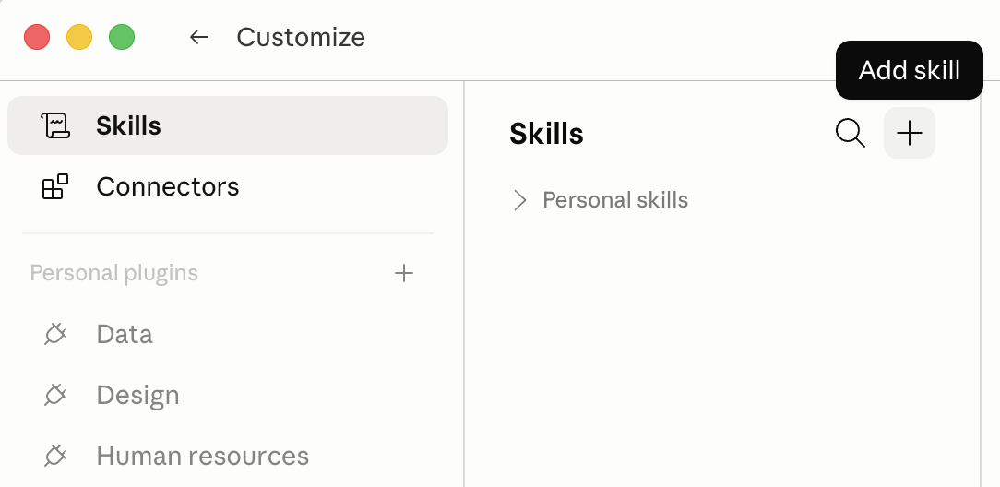
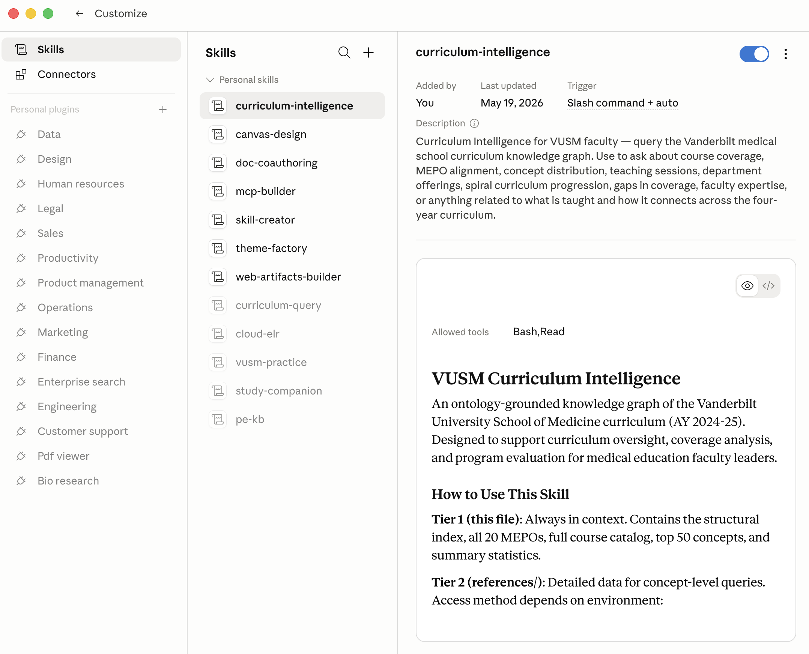

# VUSM Curriculum Intelligence — Private Preview

A Claude skill that lets you ask questions about what we teach at the Vanderbilt University School of Medicine: course coverage, MEPO alignment, where a clinical topic appears across the four-year curriculum, faculty expertise by concept, and gaps in coverage. The skill talks to a server I (Shane Stenner) maintain; your access is scoped to read-only curriculum queries and is revocable any time.

> **Private preview.** This skill is being shared with a handful of VUSM faculty for feedback. Please don't redistribute the bundle you received — each install carries an individual API key that's tied to you.

---

## What you'll need (30 seconds)

- A Claude account — either the **desktop app** (Mac or Windows) or **claude.ai** in your web browser. Both work; pick whichever you already use.
- The personalized `.zip` file Shane sent you (named `curriculum-intelligence-<your-name>.zip`).

That's it. No Terminal, no GitHub account, no command-line tools.

---

## Install (~3 minutes)

**The canonical source** for adding custom skills is Anthropic's own support article — it stays current as Claude evolves: **[Use Skills in Claude — Add and Use Custom Skills](https://support.claude.com/en/articles/12512180-use-skills-in-claude#h_a4222fa77b)**. The short version is below; if the UI you see doesn't match this page, defer to Anthropic's article.

### Step 1: One-time prerequisites

You need two settings enabled on your account before the skill can work. Both are one-time setup — once enabled, you don't need to revisit them.

**1a. Code execution.** The skill uses Claude's code-execution capability to talk to the curriculum API.

- **Free, Pro, or Max accounts:** Settings → **Capabilities** → enable **"Code execution and file creation"**.
- **Team or Enterprise accounts:** Organization settings → Skills → enable **"Code execution and file creation"** and **"Skills"** (your org admin may need to do this).

**1b. Network egress (to reach the curriculum API).** The skill makes outbound HTTPS requests to `https://vusm-curriculum-api.shanestenner.workers.dev`.

- **Free, Pro, or Max accounts:** Settings → **Capabilities** → make sure **"Allow network egress"** is on. It's usually on by default — if your skill returns "can't reach the API" errors, this is the first place to check.
- **Team or Enterprise accounts:** your **org admin** needs to either (a) set network egress to **"All domains"**, or (b) add `vusm-curriculum-api.shanestenner.workers.dev` to the organization's **specific-domains allowlist**. If your org keeps egress disabled by default, the skill will load but every query will fail until admins update the allowlist.

If you're unsure which plan tier you're on, look at Settings → Billing or ask Shane — he can tell from your invitation whether you should expect personal-plan or org-plan behavior.

### Step 2: Open the Skills section

Navigate to **Customize → Skills**.

### Step 3: Create and upload the skill

Click the **"+"** button at the top of the Skills list. From the menu, choose **"+ Create skill"**, then **"Upload a skill"**.

Select the `curriculum-intelligence-<your-name>.zip` file Shane sent you. Claude reads the bundle and confirms:

- Name: `curriculum-intelligence`
- Description starts with "Curriculum Intelligence for VUSM faculty…"

### Step 4: Verify it's in the list

The skill should now appear with a toggle switch (default: on).

That's it — no special command needed. The skill activates automatically when you ask curriculum-related questions.

Platform-specific notes if you hit a snag:
- **claude.ai web** — see [INSTALL_CLAUDE_AI.md](INSTALL_CLAUDE_AI.md).
- **Desktop app** — see [INSTALL_DESKTOP.md](INSTALL_DESKTOP.md).

---

## Try it (30 seconds of validation)

Once the skill is installed, open a new conversation in Claude and try one of these. Each should return a substantive answer drawing on the curriculum knowledge graph:

- *"How comprehensively does VUSM cover diabetic ketoacidosis?"*
- *"Which courses introduce inflammation, and when in the spiral curriculum?"*
- *"Who teaches behavioral neurology at VUSM?"*
- *"What MEPOs is the Foundations of Medical Knowledge phase aligned with?"*
- *"Where do we cover health equity across the curriculum?"*

If Claude responds with something that **doesn't** sound like it knows about VUSM-specific courses, sessions, or MEPOs — the skill probably isn't loaded. Open Settings → Skills again and confirm "Curriculum Intelligence" is listed and toggled on.

---

## What we'd love your feedback on

After you've used the skill for a session or two, please take ~5 minutes to fill out the REDCap form. It's anonymous unless you choose to add your name. See [FEEDBACK.md](FEEDBACK.md) for the link and what we're hoping to learn.

We're especially interested in:
- Did Claude get the curriculum content **right**? (Misstatements about coverage are the most important thing to flag.)
- Were the answers **useful** for the questions you'd actually want to ask in your work?
- Anything that felt **slow, broken, or surprising**?

---

## A note on security and your data

- Your zip contains an **individual API key** scoped to you. It only allows read access to the curriculum knowledge graph — it cannot upload, modify, or access any student data.
- Every query you make is logged with your consumer ID (so I can spot problems), but the log doesn't see the *content* of Claude's response — only which endpoint you called.
- If your laptop is lost, stolen, or you'd like access revoked for any reason: **email me and I'll revoke within the minute**. After revocation, the bundle stops working immediately.
- Please don't share the zip with anyone — if a colleague would also like to participate, ask me to issue them their own.

---

## FAQ

**Does this access student records or PHI?**
No. The curriculum knowledge graph contains course objectives, session metadata, concept mappings, and aggregated faculty teaching attributions. There is no student-level data in the API.

**What does it cost?**
Nothing to you. The Cloudflare Worker costs me pennies per month; it's a research/internal tool.

**Will the answers always be right?**
Claude can hallucinate, even with strong context. Treat answers like a smart colleague's first-pass take — useful as a starting point, but verify before citing in formal documents. Flag anything that looks wrong in the REDCap feedback form.

**Pilot end date?**
About 90 days from when I issued your key. I'll email a few weeks before to ask whether you'd like to extend or wrap up.

**Can I uninstall the skill?**
Yes, any time, from Settings → Skills → Curriculum Intelligence → Remove. The API key is still issued server-side; let me know and I'll revoke it.

---

## Questions?

Email Shane Stenner — same address that sent you the bundle.
